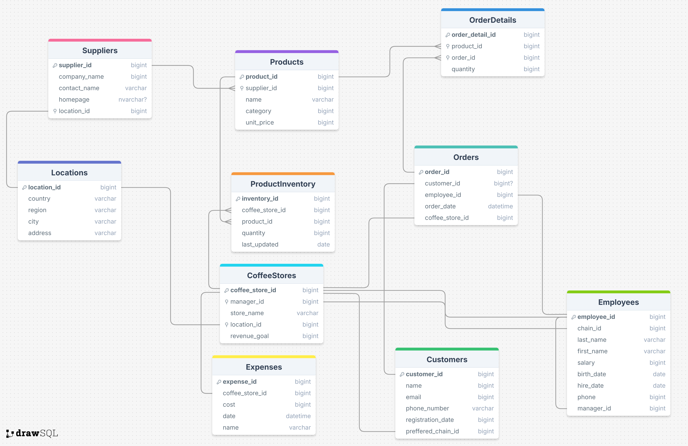
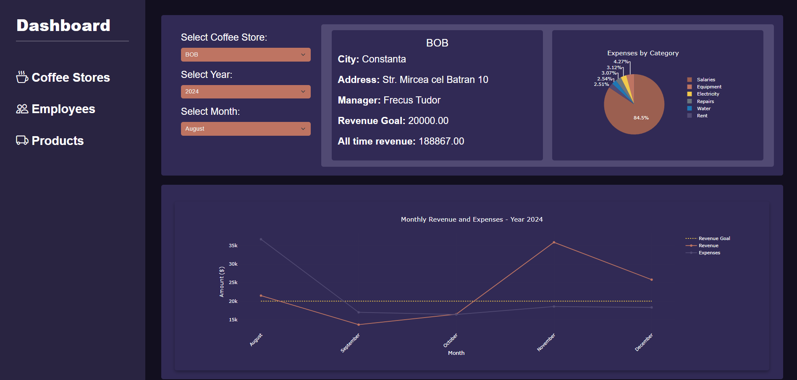
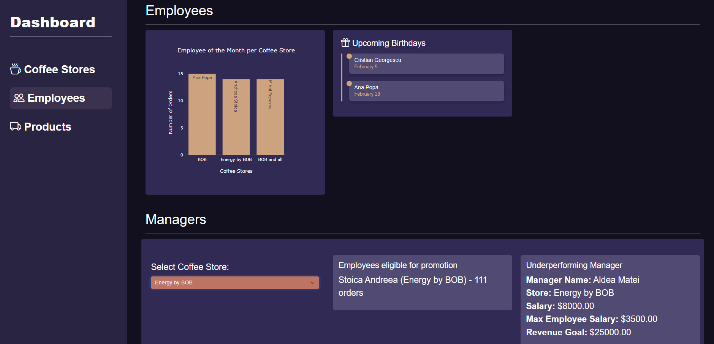
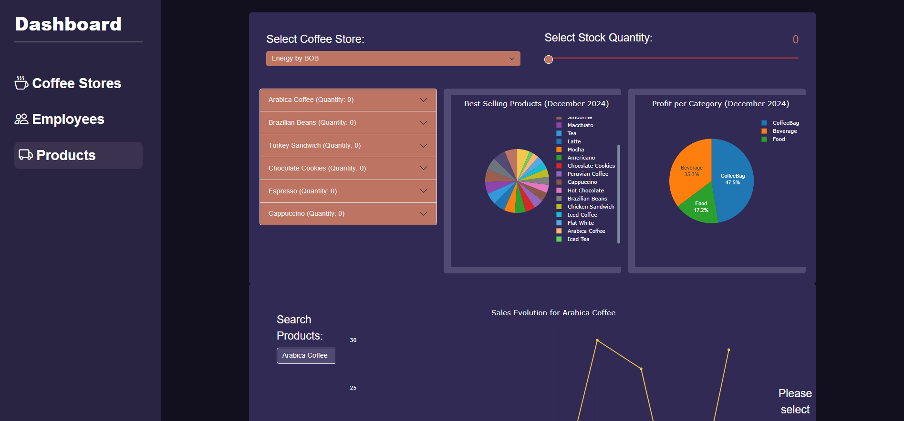

## Tema Proiectului:
Proiectul urmareste crearea unui **Admin Dashboard** pentru a gestiona un lant de cafenele, permite urmarirea performantelor  fiecarei cafenele, a angajatilor si a produselor vandute. Afiseaza rapoarte si statistici pentru a usura procesul de luare al deciziilor privind organizarea si managementul cafenelelor.


# Baza de date:
## Gestionarea:
- Pentru creare, golire si stergere am creat fisiere sql care executa in ordine operatiile necesare.
- Pentru inserare am creat tot un fisier sql care insereaza datele in tabele.   
Doar pentru Orders, Order Details si Exepenses am folosit un script python pentru a genera date random, pentru a simula datele dintr-o cafenea reala. Preturile au fost foarte umflate pentru a simula un business profitabil.  Perioada de timp aleasa a fost de cateva luni, pentru a putea afisa grafice cu date relevante.


<!--  -->
{ width=600px }


## Strucrura tabelelor:
* **CoffeeStores**: contine informatii despre fiecare cafenea in parte
    - Fiecare cafenea are un manager unic si o locatie unica
    - Tabela **Expenses** contine cheltuielile detaliate ale fiecarei cafenele, unele cheltuieli sunt obligatorii precum chiria, salarii, altele sunt optionale precum marketing
    - Tabela **ProductInventory** contine informatii despre produsele disponibile in stoc in fiecare cafenea, si cantitatea acestora
* **Employees**: contine informatii despre angajatii fiecarei cafenele
    - Fiecare angajat este unic si este asociat unei cafenele prin chain_id
    - Fiecare angajat are un manager
    - Fiecare manager raporteaza catre CEO
    - CEO are manager_id = NULL
* **Customers**: contine informatii despre clientii **inregistrati** ai fiecarei cafenele
    - Fiecare client este unic si este asociat unei cafenele prin preffered_chain_id
    - Clientii pot fi si neinregistrati ( guest ), si nu apar in aceasta tabela si doar in Orders
* **Orders**: contine informatii despre fiecare comanda
    - Tabela **OrderDetails** contine informatii despre produsele comandate si cantitatea acestora
    - Clienti care sunt asociati in Orders pot fie sa fie inregistrati, fie sa fie guest ( customer_id = NULL )
* **Products**: contine informatii despre fiecare produs
    - Fiecare produs este furnizat de un furnizor, tabela **Suppliers** contine informatii despre furnizori
* **Locations**: tabela comuna ce contine informatii strict despre locatii, atat ale cafenelelor cat si ale furnizorilor


## Constrangeri de integritate

#### 1. Chei primare
Definite pentru fiecare tabel pentru a asigura intrari unicate:
```sql
location_id BIGINT PRIMARY KEY IDENTITY(1,1)
```

#### 2. Chei straine
Leaga tabelele pentru a mentine integritatea referentiala:
```sql
FOREIGN KEY (location_id) REFERENCES Locations(location_id)
```

#### 3. Constrangeri `NOT NULL`
Asigura prezenta valorilor esentiale:
```sql
country VARCHAR(100) NOT NULL
```
Previne introducerea de date invalide sau incomplete.

#### 4. Constrangeri `CHECK`
Valideaza valori numerice si limite:
```sql
quantity INT DEFAULT 1 CHECK (quantity > 0)
```
Previne cantitati sau comenzi cu valori negative sau invalide.

#### 5. Unicitate
Constrangerea UNIQUE pentru campuri care nu trebuie sa aiba duplicate desi nu sunt chei primare:
```sql
email VARCHAR(100) UNIQUE NOT NULL
```

#### 6. Constrangeri implicite
Valori default pentru coloane:
```sql
registration_date DATE DEFAULT GETDATE()
```
Seteaza automat data curenta pentru inregistrari noi, etc.

## Proceduri si Functii:

### Cafenele

* GetCoffeeStores : Returneaza lista cu `coffee_store_id` si `store_name` pentru toate cafenelele.
* GetCoffeeStoreDetails : Afiseaza detalii despre o cafenea (nume, oras, adresa, manager, venit lunar, venit total) pentru un anumit `store_id`.
* GetMonthlyRevenue : Functie ce calculeaza venitul lunar pentru un magazin, pe baza comenzilor din luna si anul specificat.
* GetMonthlyExpenses : Functie ce calculeaza cheltuielile lunare pentru un magazin, pe baza cheltuielilor din luna si anul specificat.
* GetMonthlySalesAndExpenses : Afiseaza veniturile si cheltuielile lunare pentru o cafenea pentru un anumit an.
* GetRegisteredANDUnregisteredCustomers : Afiseaza numarul de clienti inregistrati si neinregistrati pentru un magazin.
* GetMonthlyExpensesByCategory : Returneaza un raport cu cheltuieli detaliate pe categorii pentru o cafenea, luna si an specificate.

### Angajati
* EmployeesOfTheMonth : Afiseaza, pentru fiecare cafenea, angajatul cu cele mai multe comenzi procesate in ultima luna.
* EmployeesEligibleForPromotion : Returneaza angajatii eligibili pentru promovare (minim 2 ani vechime, nu sunt manageri si au procesat > 100 de comenzi) pentru un anumit magazin.
* IsStoreUnderperforming : Functie care verifica daca un magazin este subperformant (nu a atins obiectivul de venituri in ultimele 3 luni).
* GetMaxEmployeeSalary : Functie care returneaza cel mai mare salariu dintre angajatii (fara manager) pentru un anumit magazin.
* GetUnderperformingManagers : Returneaza managerul ce trebuie inlocuit, in cazul in care magazinul este subperformant si managerul are un salariu > 2x fata de cel mai mare salariu al unui angajat.
* GetUpcomingBirthdays : Afiseaza zilele de nastere ale angajatilor care urmeaza in luna urmatoare.

### Produse
* GetAllProducts : Returneaza lista cu `product_id` si `name` pentru toate produsele.
* GetLowStockProducts : Afiseaza produsele cu cantitatea sub un anumit nivel pentru un magazin, impreuna cu informatii despre pret si supplier.
* GetMaxStockProducts : Returneaza cea mai mare cantitate pentru produsele dintr-un anumit magazin. Folosit de slider pentru a seta maximul de cantitate
* GetBestSellingProductsLastMonth : Afiseaza cele mai vandute produse (luna trecuta) pentru un magazin, numarul de bucati vandute si perioada.
* GetProfitPerCategory : Returneaza profitul total si numarul de bucati vandute, grupate pe categorii, pentru un magazin in luna trecuta.
* GetSalesEvolutionPerProduct : Afiseaza evolutia vanzarilor pe luna si an pentru un anumit produs si magazin.


# Descrierea Aplicatiei Web:

## Diagrama de Clase & Structura Claselor
- **Accesul la Date:**  
  Logica de accesare a datelor se bazeaza pe proceduri stocate din baza de date, apelate din rutele definite in `routes.py`.  
  *Observatie:* Nu se definesc clase cu sqlAlchemy, doar se apeleaza proceduri stocate prin SQLAlchemy.

- **Rute:**  
  Rutele definite in `routes.py` primesc cereri HTTP, executa procedurile stocate din baza de date si returneaza datele in format json.

- **Structura:**  
  Pagini html sunt inserate in `base.html`, in functie de ruta accesata. Clasa wrapper base contine un sidebar de unde se poate naviga pe dashboard si un main content unde se incarca datele.

  Folosing bootstrap si css unde este cazul se creeaza un layout rapid si usor de folosit iar graficele sunt generate cu Plotly.js prin jQuery.

## Conexiunea cu Baza de Date
Utilizand Flask impreuna cu SQLAlchemy, se realizeaza conexiunea cu baza de date. In fisierul config.py este definita clasa `Config` care defineste parametii necesari pentru construirea strin ului de conexiune `SQLALCHEMY_DATABASE_URI`
care este folosit pentru a stabili conexiunea.

In init.py se initializeaza aplicatia Flask, aici se configureaza folosindu-se clasa `Config`.
Tot aici se initializeaza obiectul SQLAlchemy, `db`, care este folosit pentru a executa brut procedurile stocate din baza de date prin `db.session.execute(query)`.

## Workflow-ul Aplicatiei
   - **Navigare:** Utilizatorul acceseaza paginile principale (ex. Coffee Stores, Employees, Products) din dashboard.
   - **Interactiunea cu Interfata:** Prin dropdown-uri si alte elemente interactive (gestionate cu jQuery), utilizatorul selecteaza criterii precum magazin, an sau luna.
   - **Cereri AJAX:** Selectiile declanseaza apeluri AJAX care trimit cereri catre API-urile definite in rute.
   - **Executia Procedurilor Stocate:** Rutele preiau cererile, executa procedurile stocate corespunzatoare in baza de date folosind SQLAlchemy, și returneaza datele in format JSON.
   - **Actualizarea UI:** Datele primite sunt afisate si prelucrate pe client-side, incluzand generarea de grafice cu Plotly.js.

{ width=600px }
<br><br><br>
{ width=600px }
<br><br><br>
{ width=600px }

\newpage


## Rularea aplicatiei:
1. source venv/bin/activate
2. python3 run.py

## Concluzii:
Proiectul s-a dovedit o experienta buna pentru a intelege cum se poate crea o aplicatie full stack, de la baza de date si crearea procedurilor pana la interfata web. Am depus mai mult timp decat era necesar pentru a crea o interfata realista si usor de folosit, si pentru a crea proceduri care sa aiba sens si sa fie utile pentru fiecare pagina.

## Bibliografie:
* **SQLAlchemy**: https://docs.sqlalchemy.org/
* **Flask**: https://flask.palletsprojects.com/
* **Bootstrap**: https://getbootstrap.com/docs/
* **jQuery**: https://api.jquery.com/
* **Plotly.js**: https://plotly.com/javascript/
* **DrawSQL**: https://drawsql.app/
* **Laboratoare**: https://ocw.cs.pub.ro/courses/bdd
